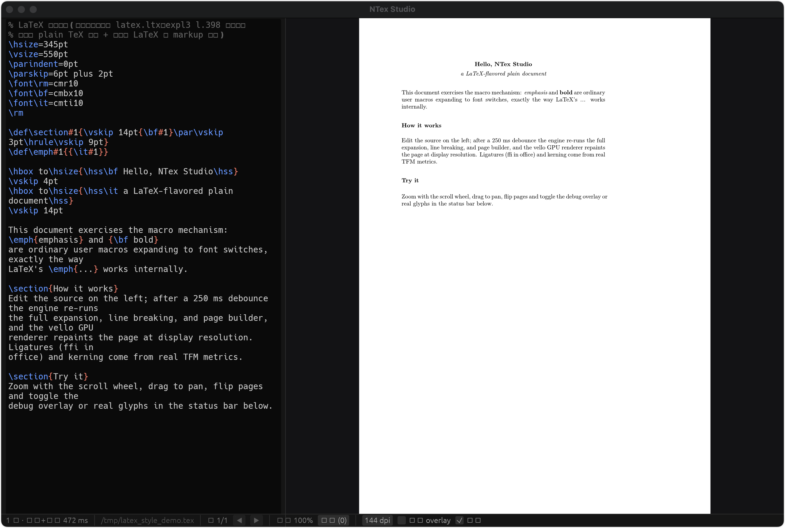

# NTex

[English](README.md) | **简体中文**

**100% 兼容 LaTeX/TeX 宏机制的现代排版 & 渲染引擎**——不修改宏语义，只换掉它的"运行平台"：
把 1970 年代的单线程 C 解释器（Web2C），重写为 **现代 VM + 增量计算 + 并行布局 + GPU 渲染** 的现代排版内核。

> 最简概括：**"一个基于状态快照的 TeX 虚拟机（求值）+ 纯节点流的多线程增量布局（排版）+ GPU/Canvas（渲染）"**



## 核心架构

```
TeX/LaTeX 源码
    ▼
0. 输入层（VFS / 文件抽象，ntex-io）
    ▼
1. TeX 虚拟机（阶段 1：求值，ntex-core）
   ┌────────────┐   ┌──────────────────────┐
   │ Token 流    │◄─►│ 不可变状态（catcode/  │
   │ (8B token) │   │ 宏字典/寄存器）快照    │
   └─────┬──────┘   └──────────────────────┘
         ▼ 宏展开 + 执行循环（字节码为默认路径）
   纯排版节点流（Node List）
    ▼
2. 增量缓存层（段级快照 + 依赖追踪 + 失效传播）
    ▼
3. 布局引擎（阶段 2：排版，ntex-layout）
   段落折行 Knuth-Plass │ 断页 │ 数学排版 │ 断字 │ 字体
    ▼
4. 盒子树 + 输出例程（\shipout）→ DVI
    ▼
5. 渲染后端（阶段 3）ntex-pdf（DVI→PDF）/ ntex-backend（vello GPU / 软光栅）
```

**四大性能支柱**：

1. **状态快照 + CoW**：不可变状态表，微秒级快照，为增量编译与撤销/重做铺路
2. **预编译 `.fmt` 内存 Dump + mmap**：毫秒级完成 `latex.ltx` 初始化（v1 已可用，v2 待做）
3. **段级记忆化增量求值**：改一段只重算受影响段（现状见 [plan.md](plan.md) §2 M5）
4. **Arena 内存池**：token/节点连续分配，零 GC 暂停（待做）

各 crate 的职责划分见 [AGENTS.md](AGENTS.md)；架构构想的完整论证见 [idea.md](idea.md)。
当前进度与里程碑状态一律见 [plan.md](plan.md)。

## 快速开始

```bash
# 质量门禁：fmt + clippy(-D warnings) + 单元测试（提交前必须全绿）
make check

# 定位基础设施（开工定位前先读 docs/tooling-trust.md）
make instrument-check                   # 仪器自检：诊断原语与 pdfTeX 逐字对拍
make abcheck TEX=probe.tex ARGS=--trace # 双引擎差分对拍
make logtrace LOG=x.transcript          # 转录/log 结构分析
make blocker-track                      # 阻塞点单调性看板

# 端到端演示：samples/demo.tex → DVI → PDF
cargo run -p ntex-dvi -- samples/demo.tex                        # → samples/demo.dvi
cargo run -p ntex-pdf -- samples/demo.dvi                        # → samples/demo.pdf
cargo run -p ntex-backend -- samples/demo.tex demo 144 --vello   # → PNG（GPU + 真字形）

# LaTeX 快路径：无需外部 TeX Live，默认从 assets/fmt 与 assets/tex-minimal 查找
cargo run -p ntex-dvi -- --fmt latex.fmt doc.tex
cargo run -p ntex-dvi -- --generate-fmt /tmp/latex.fmt    # 引擎语义变更后重生成发行 fmt

# 实时预览工作台（左 TeX 编辑 / 右 vello GPU 渲染，250ms 防抖重排）
cargo run -p ntex-studio [文件.tex]
make tauri                                                # Tauri 桌面壳（排版+渲染全在前端 WASM 内）

# 一致性 / 差分 / 基准管路
make trip / make diff / make bench
make fixtures / make fixture-extras        # 获取 TRIP·ETRIP / 补充对照 fixtures
make lvt-fetch / make lvt-run ARGS=--all   # expl3 官方测试套件跑分
```

`ntex-dvi` 的 `\input` 默认搜索链：cwd → 显式 `--input-path` → 可执行文件同目录 `tex/` →
`~/.ntex/tex/` → `TEXINPUTS` → 仓库/发行包 `assets/tex-minimal/tex/` → 检测到的
`~/.TinyTeX/texmf-dist/tex/` → 最后回落 `kpsewhich`。完整资产说明见
[assets/tex-minimal/README.md](assets/tex-minimal/README.md)。

## 开发约定

### 编码规范

- **工程级 lint**：workspace 统一 `unsafe_code = "deny"`，clippy 全开——严禁 `unsafe`，
  禁止 `catch_unwind`；
- **错误模型**：错误走 `Result`/`Error`，输入可达路径禁止 `unwrap`/`expect`/`panic`
  （引擎契约：**任意畸形输入不 panic**）；错误类型不带 blanket `From<io::Error>`，
  强制带操作意图上下文；
- **注释/文档/提交信息用中文**；模块顶部文档引用里程碑 ID（如 `M1-4`）与 RFC 章节
  （如 `RFC-1 §3`）；代码改动须同步更新对应注释；
- **格式**：`rustfmt.toml` = edition 2021 / max_width 100 / use_field_init_shorthand；
- 提交信息风格：中文，`feat:` 开头，冒号后空格
  （例：`feat: ETRIP 冲刺迭代 —— 表达式 i128 中间量 + 胶水阶语义`）。

### 测试纪律

- **提交前 `make check` 全绿**（fmt + clippy `-D warnings` + 单元测试）；
- 测试金字塔：单元测试（语义锁消息 / 逐位对照）> 差分测试（同一 `.tex` 双引擎 diff）>
  TRIP/ETRIP（一致性硬口径）；M2 双轨等价框架（解释器 vs 字节码）必须保持绿；
- **`cargo test --release` 会失败**：`[profile.release]` 开了 `panic = "abort"` + `lto` +
  `codegen-units = 1`——**测试一律用默认 dev profile**（CI 亦如此）；
- 涉及排版一致性/折行结果，验证方式：`demo.tex → DVI` 与 dvipdfmx / 真实 TeX 对照；
- 定位类改动先读 [docs/tooling-trust.md](docs/tooling-trust.md)（仪器失真史 + 判读纪律），
  改诊断原语后必跑 `make instrument-check`。

### 文档约定

- **进度只写 [plan.md](plan.md)**（唯一进度源）；目录结构只写 [AGENTS.md](AGENTS.md)；
- 长期参考文档（"是什么 / 怎么做"）放 `docs/`；历史战报与勘察全文放 `docs/archive/`；
- 新增任何"简化 / no-op / 暂不"实现必须当天登记到
  [docs/KNOWN-SIMPLIFICATIONS.md](docs/KNOWN-SIMPLIFICATIONS.md)（文件:行），修复后标 ✅ + commit。

## 文档地图

| 文档 | 定位 |
|---|---|
| [plan.md](plan.md) | **整体进度**：当前焦点 / 各线状态 / 里程碑明细 / 待办 / 风险 |
| [AGENTS.md](AGENTS.md) | **目录结构**：crate 职责、源文件布局、docs 索引 |
| [idea.md](idea.md) | 架构构想（三阶段解耦 / 增量计算 / 并行布局的完整论证） |
| [RFC-1-token.md](RFC-1-token.md) | Token 表示与内存布局（8B tagged union） |
| [RFC-3-side-effects.md](RFC-3-side-effects.md) | 副作用隔离（VFS + shipout 边界提交） |
| [RFC-4-bytecode.md](RFC-4-bytecode.md) | 字节码指令集（宏展开 VM IR） |
| [RFC-5-parallel.md](RFC-5-parallel.md) | 并行化设计 |
| [docs/KNOWN-SIMPLIFICATIONS.md](docs/KNOWN-SIMPLIFICATIONS.md) | 技术债清单（改动前先查表） |
| [docs/tooling-trust.md](docs/tooling-trust.md) | 定位基础设施与仪器可信度 |
| [docs/MATH-STATE-MACHINE.md](docs/MATH-STATE-MACHINE.md) | 数学状态机语义规格 |
| [docs/archive/](docs/archive/README.md) | 历史归档索引（逐刀战报、勘察全文） |

## License

MIT OR Apache-2.0
